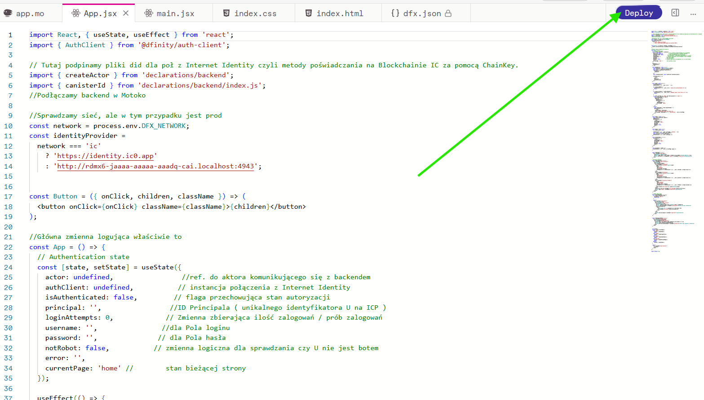

# Zadanie 2 React
Nazwa * ( Who-am-I ) ponieważ użyłem szablonu dla podłączenia z Internet Identity pod React ( opisałem biblioteki do podłączenia w kodzie frontendowym ) 

## Uruchomienie projektu 
Bezpośredni link do dApp na ICP.Ninja ( Shared Project)

https://icp.ninja/s/z4MWn

Daploy na blockchain ICP produkcyjnie na 20 minut wykonujmey za pomocą 

